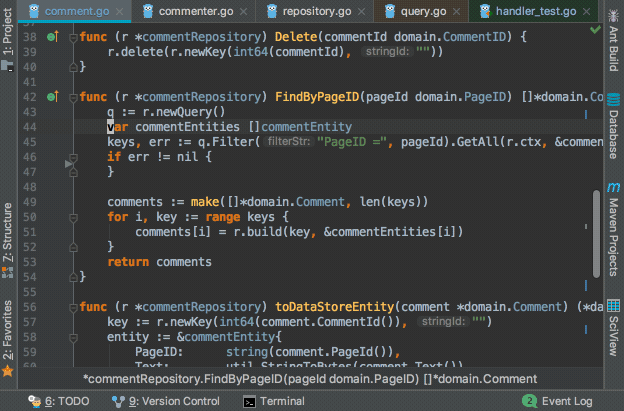
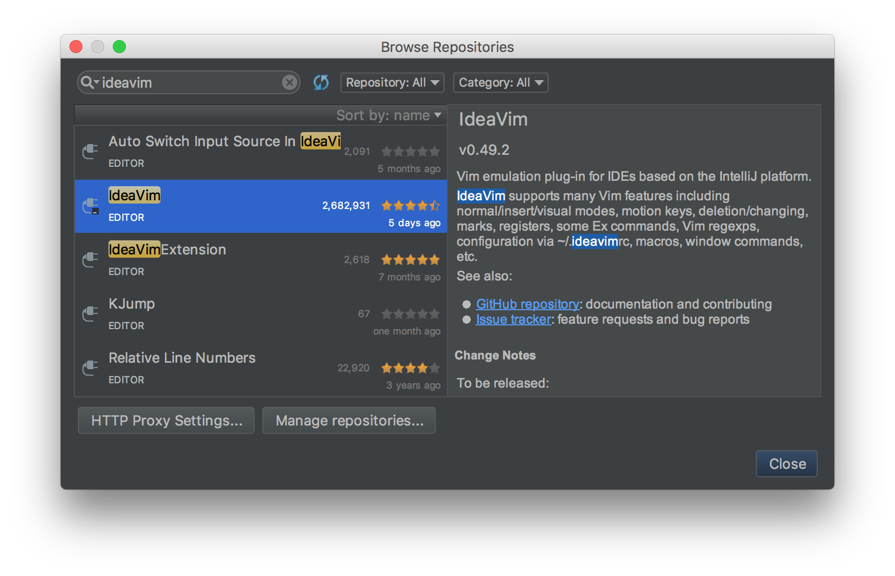
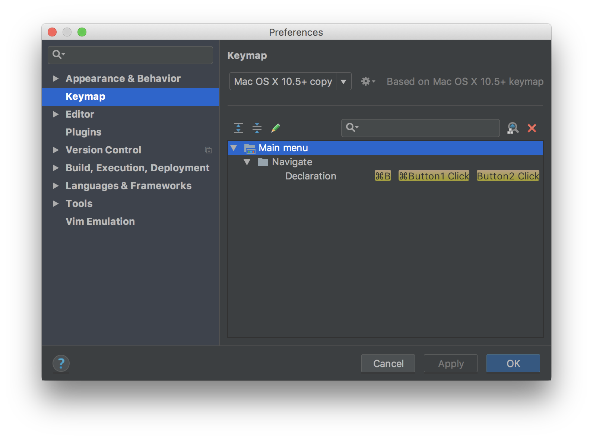
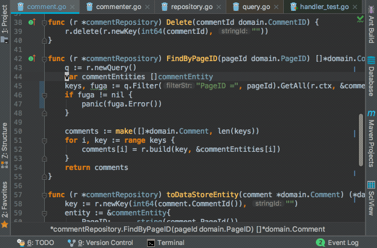

この記事は[JetBrains Advent Calendar 2017](https://qiita.com/advent-calendar/2017/jetbrains)
の最終日分の投稿です。前日まで空いていたため、滑り込みで参加させていただきました！

## IdeaVim

[IdeaVim](https://plugins.jetbrains.com/plugin/164-ideavim)
Github: [JetBrains/ideavim](https://github.com/JetBrains/ideavim)

IdeaVim は、**IntelliJ や Android Studio などの JetBrains 系列の IDE で使える Vim プラグイン** です。このプラグインを導入することで
IntelliJ などを Vim っぽく操作できるようになります。\
リポジトリ名を見るとわかるように、JetBrains の公式プラグインです。IntelliJ の初回起動時にもオススメされます。

※ 以下、IntelliJ を例にして進めますが、JetBrains 系列の IDE であれば基本的に一緒なはずですので自身の使っているものに置き換えてお読みください。

### 雰囲気

※キーマップはカスタマイズ済です。



### なぜ IdeaVim を使うか

個人的には、IntelliJ と Vim のそれぞれに対して以下の点に良さを感じています。

- **IntelliJ**: 補完、コードジャンプ、リファクタ機能などの強力さ、またそれらの設定の容易さ
- **Vim**: テキストエディタとしての編集操作の効率の良さ、キーマップやモードの概念

IdeaVim プラグインを使うと、
**IntelliJ を Vim のようなキーマップとして操作できるようになり、かつ、そのキーマップで IntellIJ の機能を呼び出すことも可能です**。
そのため、上記の双方の利点を同時に享受することができると考えています。 細かい部分の挙動などはまだまだ本家 Vim との差分もありますが、
**自分のような比較的ライトな Vim ユーザーが Vim に求めている機能については、IdeaVim はその多くをカバーできているのではないか**と思います。

この記事では IdeaVim の機能や設定方法の説明を通じて、IdeaVim の良さをお伝えしていきます。

## IdeaVim がサポートしている機能の一例

細かい機能まで列挙するのは難しいため、普段自分がよく使う機能に絞ってその対応状況をまとめました。\
行いたい操作が未実装だったという経験は筆者は無いですが、これは vim のヘビーユース度合いにもよるのかなとも思います。

| 機能             | 対応状況                                                                                                                                                |
| ---------------- | ------------------------------------------------------------------------------------------------------------------------------------------------------- |
| モード           | ノーマルモード、インサートモード、ビジュアルモードが存在                                                                                                |
| モーション       | ヤンク(`y`), 削除(`d`), 変更(`c`), Undo(`u`), Redo(`Ctrl-r`),<br>テキストオブジェクト操作(`ciw`,`vi(`, ...) などなど                                    |
| 検索             | Vim と同様に`/`による検索が可能、`:set incsearch`によるインクリメンタルサーチも                                                                         |
| 置換             | Vim と同様に`:s`,`:%s`,`:'<,'>s`などで正規表現による置換が可能                                                                                          |
| コマンド         | `:w`, `:q`, `:tabnew`, `:split`, 一部`:set`オプション などなど                                                                                          |
| 設定・キーマップ | `.vimrc`と同様の文法で各種`map`や一部`set`オプションを`.ideavimrc`に記述可能<br>また、IntelliJ の機能をキーマッピングすることも可能(後の章で詳しく説明) |
| マクロ           | 利用可能                                                                                                                                                |
| レジスタ         | 利用可能                                                                                                                                                |
| その他           | `:set surround`することで[vim-surround](https://github.com/tpope/vim-surround)を再現した機能を利用可能                                                  |

より詳しく知りたいという方は、
[GitHub のレポジトリ](https://github.com/JetBrains/ideavim)
の README などご覧になってみてください。

## IdeaVim のインストール方法

通常の IntelliJ プラグインと同じく、`[Preferences] > [Plugins]`からインストールできます。\
インストール後に IntelliJ を再起動すると IdeaVim が有効になります。



### EAP ビルド

IdeaVim のアップデートは現状だと年に数回程度しか行われていません。
IntelliJ 内から`[Settings] > [Plugins] > [Browse Repositories] > [Manage Repositories]`に下記の URL
を追加することで、まだ正式にはリリースされていない EAP[^eap]ビルドの IdeaVim を利用することができます。
[^eap]: Early Access Program

<https://plugins.jetbrains.com/plugins/eap/ideavim>

不便だと思っていた不具合が EAP ビルドでは直っているみたいなケースも少なくないので、筆者は常に最新の EAP ビルドを利用しています。

## IdeaVim の設定方法

### .ideavimrc

IdeaVim では、`.ideavimrc`というファイルに設定を記述してホームディレクトリに設置しておくことで、IntelliJ 起動時にその設定を読み込んでくれます。\
`.ideavimrc`には **本家 Vim の`.vimrc`と同様、各種 map コマンドや set コマンドを記述することが可能です。**

利用できる`set`
コマンドのオプション一覧は[こちら](https://github.com/JetBrains/ideavim/blob/master/doc/set-commands.md)にあります。\
また、IdeaVim 独自のオプションとして`set surround`というものが存在し、本家 Vim
で言うところの[vim-surround](https://github.com/tpope/vim-surround)を一部再現した機能が利用可能となっています。

### Vim と IdeaVim のキーマップの一元管理

`map`コマンドが本家 vim と同じ記述で利用可能なため、`nnoremap L $`などとといったような基本的なキーマップは、通常の`.vimrc`
から切り出して`.vimrc.keymap`という独立したファイルにしておき、`.vimrc`と`.ideavimrc`それぞれから`source`
コマンドを使って読み込むのがおすすめです。\
こうすることで、Vim と IdeaVim で共通して設定しておきたいような基本的なキーマップを一元管理できるようになります。これは`.ideavimrc`が`.vimrc`
とほとんど同じ文法で記述できるからこそのメリットですね。

##### .ideavimrc

```vim
" 切り出しておいた共通keymapファイルをロード
source .vimrc.keymap

" IdeaVim特有の設定はここに書き足していく
```

##### .vimrc.keymap

```vim
" IdeaVimとvimどちらでも共通のキーマップはここに書く

nnoremap L $
nnoremap H ^
noremap ; :
```

参考までに、自分の`.ideavimrc`と`.vimrc.keymap`も以下に載せておきます。

- [.vimrc.keymap](https://github.com/ikenox/dotfiles/blob/master/vimrc.keymap)
- [.ideavimrc](https://github.com/ikenox/dotfiles/blob/master/ideavimrc)

### IntelliJ の機能をキーマッピング

基本的なキーマップは`.vimrc.keymap`に切り出したので、`.ideavimrc`には IdeaVim 特有の設定が残ることになります。
筆者の`.ideavimrc`を見てもらうと、たとえば以下のように、`nnoremap XXX :action YYY`という記述が多くあることがわかります。

```vim
nnoremap gd :action GotoDeclaration
```

`:action`は IdeaVim オリジナルのコマンドで、このコマンドを使うと IntelliJ の機能を呼び出すことができます。`GotoDeclaration`は IntelliJ
の機能の一つであり、「カーソル上の変数や関数の定義元に飛ぶ」という操作です。\
つまり上記の 1 行は、「`gd`をキーストロークするとカーソル上の変数や関数の定義元に飛ぶ」という設定となります。
このように、**IdeaVim では`:action`コマンドで IntelliJ の機能(アクション)を呼び出して使用することができます。IntelliJ
の強力なコードジャンプやリファクタ機能についても、Vim のキーマップ的な設定や呼び出しが可能ということになります**。\
カーソルの移動などの単純な操作から、リファクタやコードジャンプ等のもっと高次な機能まで、IntelliJ が API
として提供しているアクションや、インストールしているプラグインで定義されているアクションは全て呼び出せるようです。\
このアクション呼び出し機能によって、IdeaVim と IntelliJ の連携の自由度が格段に上がりました。以下に、筆者が高頻度で使うおすすめのアクションの一例を載せておきます。

#### 設定しておくと幸せになれそうなアクションの一例

| Action               | 概要                                                    |
| -------------------- | ------------------------------------------------------- |
| SearchEverywhere     | 任意のクラス・関数・ファイルを検索・ジャンプ            |
| FindInPath           | 開いているプロジェクト内の任意の文字列を検索(grep 的な) |
| FileStructurePopup   | 編集しているファイル内の任意の関数を検索・ジャンプ      |
| GotoDeclaration      | カーソル上の関数や変数の定義元にジャンプ                |
| GotoSuperMethod      | カーソル上の関数のスーパーメソッドにジャンプ            |
| GotoImplementation   | カーソル上のインターフェースの実装にジャンプ            |
| JumpToLastChange     | 最後に編集した箇所にジャンプ                            |
| FindUsages           | カーソル上の関数や変数の使用箇所一覧を表示              |
| RenameElement        | カーソル上の関数や変数の rename                         |
| ReformatCode         | コードの整形                                            |
| CommentByLineComment | コメントアウト                                          |
| ShowIntentionActions | クイックフィックス                                      |
| GotoAction           | なんでも呼び出し                                        |

#### 設定例

```vim
nnoremap ,e :action SearchEverywhere<CR>
nnoremap ,g :action FindInPath<CR>
nnoremap ,s :action FileStructurePopup<CR>

nnoremap gd :action GotoDeclaration<CR>
nnoremap gs :action GotoSuperMethod<CR>
nnoremap gi :action GotoImplementation<CR>
nnoremap gb :action JumpToLastChange<CR>

nnoremap U :action FindUsages<CR>
nnoremap R :action RenameElement<CR>

nnoremap == :action ReformatCode<CR>
vnoremap == :action ReformatCode<CR>

nnoremap cc :action CommentByLineComment<CR>
vnoremap cc :action CommentByLineComment<CR>

nnoremap <C-CR> :action ShowIntentionActions<CR>

nnoremap ,a :action GotoAction<CR>
vnoremap ,a :action GotoAction<CR>
```

※ ビジュアルモードでの範囲選択に対する`:action`コマンドの適用については、バージョン 0.49.3 以降で利用可能です。2018 年 2 月現在では EAP
ビルドの最新版で利用できます。

### アクションの検索

「自分がいつも使ってるあの機能のアクション名を知りたい」といった際に、直接的に探す方法は無いのが現在の難点です。
ただ、下記の手順を踏むとだいたいはそこまで苦労せずに見つかるかと思います。

まず、IntelliJ の`[Preferences] > [Keymap]`から、設定したい機能を探します。その機能に IntelliJ
デフォルトで割り当てられているショートカットキーから探すと早いです。



見つかったら、その機能の名前を確認しておきます。

次に、`:actionlist`コマンドを使うことで、IdeaVim で呼び出し可能なアクションの一覧を確認することができます。 また、`:actionlist XXX`
とすると、名前に`XXX`を含むアクションを検索することもできます。



さきほど確認した機能名とアクション名は似ていることが多いため、機能名の一部や、その機能を連想するような単語（検索関連の機能なら`search`
とか）で検索して、それっぽいのがヒットしたら試してみる、というのを当たるまで繰り返します。\
検索結果には現在そのアクションに割り当てられているショートカットキーも表示されるため、それも参考にすると見つけやすいかと思います。
(ショートカットキーでアクションの検索ができるようになってくれると便利そうですね…)

2019/04/29 追記: [出していたプルリク](https://github.com/JetBrains/ideavim/pull/159)
がマージされたので、v.0.52 からはショートカットキーでもアクションの絞り込みが可能となる見込みです。

## おわりに

本記事では IdeaVim の機能や設定方法について紹介しました。\
IdeaVim はまだ発展途上な部分もありますが、IntelliJ の強力な機能をそのまま活かしつつ Vim
の操作性を取り入れることができる素晴らしいプラグインだと思います。\
IdeaVim を使いこなして、快適な IntelliJ ライフを送りましょう！
