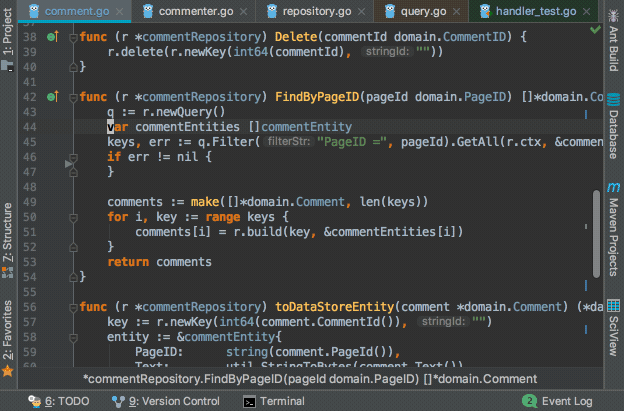
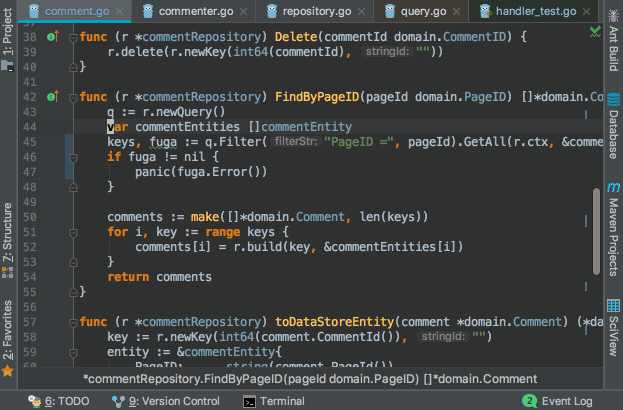

Japanese version is [here](/blog/ideavim-introduction)

## IdeaVim

<preview-link title="IdeaVim" url="https://plugins.jetbrains.com/plugin/164-ideavim"></preview-link>
Github: [JetBrains/ideavim](https://github.com/JetBrains/ideavim)

IdeaVim is a Vim emulation plugin for IntelliJ or other Jetbrains IDEs. This plugin are officially developed by Jetbrains as you can see the repository owner name.

### Demo

Keymap is personally customized.

</img>

### Why use IdeaVim

The advantages in each of IntelliJ and Vim are as follows, I think.

- **IntelliJ**: Very powerful code completeion, code navigation, refactoring, and so on with easy and simple settings.
- **Vim**: Very various and efficient operations as a text editor. A concept of the mode(normal/insert/visual).

So, **IntelliJ with Vim-like operation can take both of these advantages**. IdeaVim supports many Vim features.

In this blog post, I'll introduce what features IdeaVim supports, how to setup IdeaVim, and how great IdeaVim is.

## Supported Vim features

The followings are commonly used Vim features supported by IdeaVim.

| Feature  | Supported                                                                                                                                                                       |
| -------- | ------------------------------------------------------------------------------------------------------------------------------------------------------------------------------- |
| Mode     | NORMAL, INSERT and VISUAL mode                                                                                                                                                  |
| Motions  | yank(`y`), delete(`d`), change(`c`), undo(`u`), redo(`Ctrl-r`), <br>text object operation(`ciw`,`ci'`, ... ) and so on                                                          |
| Search   | textsearch and highlight by `/`, incremental search by `:set incsearch`                                                                                                         |
| Replace  | `:s`,`:%s`,`:'<,'>s` and so on                                                                                                                                                  |
| Commands | `:w`, `:q`, `:tabnew`, `:split`, a part of `:set` command and so on                                                                                                             |
| Keymap   | We can customize keymaps by same syntax with `.vimrc`. We can use `map`, `set` and other some commands. The details of this feature will be introduced later of this blog post. |
| Macro    | available                                                                                                                                                                       |
| Register | available                                                                                                                                                                       |
| Others   | `:set surround` enables [vim-surround](https://github.com/tpope/vim-surround) emulation                                                                                         |

You can see more details at README.md of [GitHub repositoy](https://github.com/JetBrains/ideavim).

## Install IdeaVim

In IntelliJ or other Jetbrains IDEs, you can install IdeaVim from `[Preferences] > [Plugins]`.
After install, you have to restart the IDE to enable IdeaVim.


### EAP build

You can install an EAP (Early Access Program) build of IdeaVim by adding the following URL to `[Settings] > [Plugins] > [Browse Repositories] > [Manage Repositories]`.

[https://plugins.jetbrains.com/plugins/eap/ideavim](https://plugins.jetbrains.com/plugins/eap/ideavim)

Currently, a new version of IdeaVim is officially released a few times for a year, so sometimes bug fixes or new features are not released soon. So I normally use the EAP build.

## How to setup IdeaVim

### .ideavimrc

IdeaVim loads a file `~/.ideavimrc` when the IDE started. We can write the settings to `.ideavimrc`, with the same syntax as `.vimrc`. A list of supported `set` commands is [here](https://github.com/JetBrains/ideavim/blob/master/doc/set-commands.md).  
In addition, a `set surround` command enables a [vim-surround](https://github.com/tpope/vim-surround) emulation.

```vim
set incsearch
set ignorecase
set smartcase

nnoremap L $
nnoremap H ^
noremap ; :
```

### Share the keymaps between Vim and IdeaVim

`.vimrc` and `.ideavimrc` can be written as the same syntax. This is a large advantage, because you don't need to learn new specific syntax, and you can share the settings of the common basic keymaps (e.g. `nnoremap ; :`) between both of them.

To share the settings, I prepared a shared keymaps file `.vimrc.keymap`. It is loaded in `.vimrc` and `.ideavimrc` by a `source` command. Thus you can centralize the common basic keymaps to the one file.

#### .ideavimrc

```vim
" Load common basic keymaps
source .vimrc.keymap

" IdeaVim specific settings are here
```

#### .vimrc.keymap

```vim
" Common basic keymaps
nnoremap L $
nnoremap H ^
noremap ; :
```

The followngs are my `.ideavimrc` and `.vimrc.keymap`.

- [.ideavimrc](https://github.com/ikenox/dotfiles/blob/master/ideavimrc)
- [.vimrc.keymap](https://github.com/ikenox/dotfiles/blob/master/vimrc.keymap)

### Vim-like keymap to IntelliJ functions

In my `.ideavimrc`, a statement `map XXX :action YYY` often appears. `:action` is a IdeaVim-specific command. By using `:action` command, you can call IntelliJ functions.

The following is an example of keymap.

```vim
nnoremap gd :action GotoDeclaration
```

`GotoDeclaration` is one of an "action". An action corresponds to one of the IntelliJ functions. It navigates to the declaration of the symbol on the text cursor. So, `nnoremap gd :action GotoDeclaration` means, "When you type `gd` in the normal mode, then you'll be navigated to the declaration of the symbol".  
Thus, by using an `:action` command, **you can define a vim-like keymap to any IntelliJ functions, even very powerful code modification, code navigation, refactoring, and the more functions.**

You can call any IntelliJ functions, from high-level functions (e.g. refactoring) to low-level functions (e.g. move text cursor). You can also call the functions of the IntelliJ plugin you've installed.

The `:action` command dramatically boosts the usability of IdeaVim-ed IntelliJ.  
The followings are my recommended actions.

#### Examples of Action

| Action               | Description                                    |
| -------------------- | ---------------------------------------------- |
| SearchEverywhere     | Navigate to any symbol                         |
| FindInPath           | Find text in the whole project                 |
| FileStructurePopup   | Navigate to any symbol in current file         |
| GotoDeclaration      | Navigate to the declaration of a symbol        |
| GotoSuperMethod      | Navigate to the super method of a symbol       |
| GotoImplementation   | Navigate to the implementation of an interface |
| JumpToLastChange     | Navigate to the place changed at last          |
| FindUsages           | List the usages of a symbol                    |
| RenameElement        | Rename a symbol                                |
| ReformatCode         | Format code                                    |
| CommentByLineComment | Comment out                                    |
| ShowIntentionActions | Quick fix                                      |
| GotoAction           | Call anything                                  |

#### An example

```vim
nnoremap ,e :action SearchEverywhere<CR>
nnoremap ,g :action FindInPath<CR>
nnoremap ,s :action FileStructurePopup<CR>

nnoremap gd :action GotoDeclaration<CR>
nnoremap gs :action GotoSuperMethod<CR>
nnoremap gi :action GotoImplementation<CR>
nnoremap gb :action JumpToLastChange<CR>

nnoremap U :action FindUsages<CR>
nnoremap R :action RenameElement<CR>

nnoremap == :action ReformatCode<CR>
vnoremap == :action ReformatCode<CR>

nnoremap cc :action CommentByLineComment<CR>
vnoremap cc :action CommentByLineComment<CR>

nnoremap <C-CR> :action ShowIntentionActions<CR>

nnoremap ,a :action GotoAction<CR>
vnoremap ,a :action GotoAction<CR>
```

### Search an action name

If you want to know an action name of some IntelliJ functions, you can use an `:actionlist` command.
By using the command you can search an action by words.

</img>

But, currently there is no way to know the action name of the IntelliJ function which you want to call from IdeaVim.  
Calling `:actionlist` will display assigned shortcut key for the each action. It may be a hint of the corresponded IntelliJ function.

## Conclusion

In this blog post, I introduced IdeaVim. IdeaVim hasn't emulated Vim completely yet, but it's still a great plugin.  
Let's enjoy IdeaVim!
