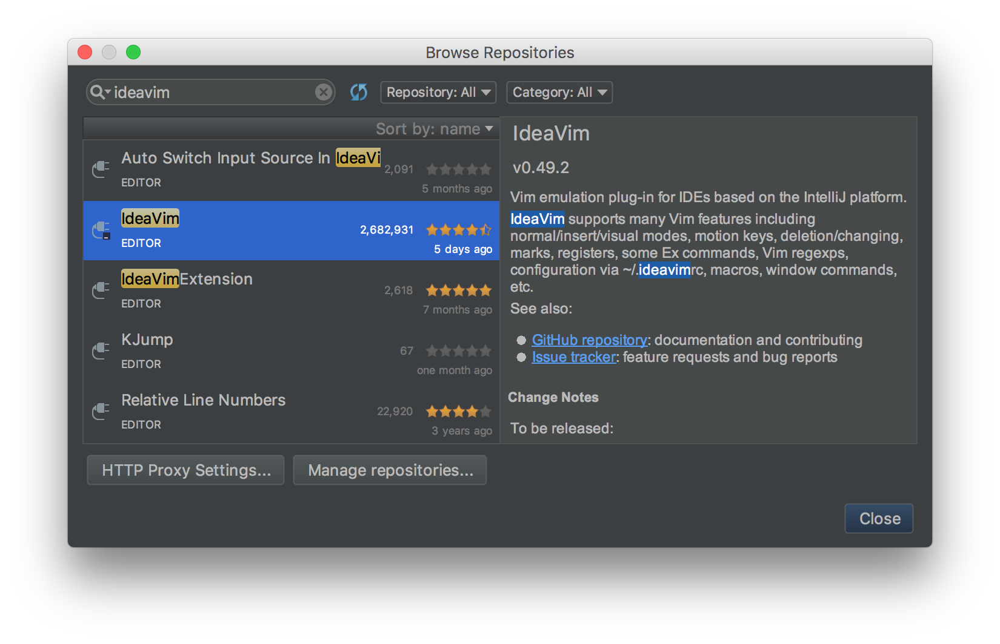

この記事は[JetBrains Advent Calendar 2017](https://qiita.com/advent-calendar/2017/jetbrains)の最終日分の投稿です。前日まで空いていたため、滑り込みで参加させていただきました！

## IdeaVim

<preview-link title="IdeaVim" url="https://plugins.jetbrains.com/plugin/164-ideavim"></preview-link>
Github: [JetBrains/ideavim](https://github.com/JetBrains/ideavim)

IdeaVimは、**IntelliJやAndroid StudioなどのJetBrains系列のIDEで使えるVimプラグイン** です。このプラグインを導入することでIntelliJなどをVimっぽく操作できるようになります。  
リポジトリ名を見るとわかるように、JetBrainsの公式プラグインです。IntelliJの初回起動時にもオススメされます。

※ 以下、IntelliJを例にして進めますが、JetBrains系列のIDEであれば基本的に一緒なはずですので自身の使っているものに置き換えてお読みください。

### 雰囲気

※キーマップはカスタマイズ済です。

<video controls="controls" src="/assets/ideavim.mp4" type="video/mp4"></video>

### なぜIdeaVimを使うか

個人的には、IntelliJとVimのそれぞれに対して以下の点に良さを感じています。

- **IntelliJ**: 補完、コードジャンプ、リファクタ機能などの強力さ、またそれらの設定の容易さ
- **Vim**: テキストエディタとしての編集操作の効率の良さ、キーマップやモードの概念

**IntelliJにIdeaVimプラグインを導入することで、上記の双方の利点を同時に享受することができる**と考えています。
細かい部分の挙動などはまだまだ本家Vimとの差分もありますが、**自分のような比較的ライトなVimユーザーがVimに求めている機能については、IdeaVimはその多くをカバーできているのではないか** と思います。  

この記事ではIdeaVimの機能や設定方法の説明を通じて、IdeaVimの良さをお伝えしていきます。


## IdeaVimがサポートしている機能の一例

細かい機能まで列挙するのは難しいため、普段自分がよく使う機能に絞ってその対応状況をまとめました。  
行いたい操作が未実装だったという経験は筆者は無いですが、これはvimのヘビーユース度合いにもよるのかなとも思います。

|機能|対応状況|
|:-------|:---|
|モード|ノーマルモード、インサートモード、ビジュアルモードが存在|
|モーション|ヤンク(`y`), 削除(`d`), 変更(`c`), Undo(`u`), Redo(`Ctrl-r`),<br>テキストオブジェクト操作(`ciw`,`vi(`, ...) などなど|
|検索| Vimと同様に`/`による検索が可能、`:set incsearch`によるインクリメンタルサーチも|
|置換| Vimと同様に`:s`,`:%s`,`:'<,'>s`などで正規表現による置換が可能|
|コマンド|`:w`, `:q`, `:tabnew`, `:split`, 一部`:set`オプション などなど |
|設定・キーマップ|`.vimrc`と同様の文法で各種`map`や一部`set`オプションを`.ideavimrc`に記述可能<br>また、IntelliJの機能をキーマッピングすることも可能(後の章で詳しく説明)|
|マクロ|利用可能|
|レジスタ|利用可能|
|その他|`:set surround`することで[vim-surround](https://github.com/tpope/vim-surround)を再現した機能を利用可能|

より詳しく知りたいという方は、
[GitHubのレポジトリ](https://github.com/JetBrains/ideavim)
のREADMEなどご覧になってみてください。


## IdeaVimのインストール方法

通常のIntelliJプラグインと同じく、`[Preferences] > [Plugins]`からインストールできます。  
インストール後にIntelliJを再起動するとIdeaVimが有効になります。



### EAPビルド

IdeaVimのアップデートは現状だと年に数回程度しか行われていません。
IntelliJ内から`[Settings] > [Plugins] > [Browse Repositories] > [Manage Repositories]`に下記のURLを追加することで、まだ正式にはリリースされていないEAP[^1]ビルドのIdeaVimを利用することができます。  
[https://plugins.jetbrains.com/plugins/eap/ideavim](https://plugins.jetbrains.com/plugins/eap/ideavim)  
不便だと思っていた不具合がEAPビルドでは直っているみたいなケースも少なくないので、筆者は常に最新のEAPビルドを利用しています。

[^1]: Early Access Program

## IdeaVimの設定方法

### .ideavimrc

IdeaVimでは、`.ideavimrc`というファイルに設定を記述してホームディレクトリに設置しておくことで、IntelliJ起動時にその設定を読み込んでくれます。  
`.ideavimrc`には **本家Vimの`.vimrc`と同様、各種mapコマンドやsetコマンドを記述することが可能です。**  

利用できる`set`コマンドのオプション一覧は[こちら](https://github.com/JetBrains/ideavim/blob/master/doc/set-commands.md)にあります。  
また、IdeaVim独自のオプションとして`set surround`というものが存在し、本家Vimで言うところの[vim-surround](https://github.com/tpope/vim-surround)を一部再現した機能が利用可能となっています。

### VimとIdeaVimのキーマップの一元管理

`map`コマンドが本家vimと同じ記述で利用可能なため、`nnoremap L $`などとといったような基本的なキーマップは、通常の`.vimrc`から切り出して`.vimrc.keymap`という独立したファイルにしておき、`.vimrc`と`.ideavimrc`それぞれから`source`コマンドを使って読み込むのがおすすめです。  
こうすることで、VimとIdeaVimで共通して設定しておきたいような基本的なキーマップを一元管理できるようになります。これは`.ideavimrc`が`.vimrc`とほとんど同じ文法で記述できるからこそのメリットですね。

参考までに、自分の`.ideavimrc`と`.vimrc.keymap`を以下に載せておきます。

- [.vimrc.keymap](https://github.com/ikenox/dotfiles/blob/master/vimrc.keymap)
- [.ideavimrc](https://github.com/ikenox/dotfiles/blob/master/ideavimrc)

### IntelliJの機能をキーマッピング

基本的なキーマップは`.vimrc.keymap`に切り出したので、`.ideavimrc`にはIdeaVim特有の設定が残ることになります。
筆者の`.ideavimrc`を見てもらうと、たとえば以下のように、`nnoremap XXX :action YYY`という記述が多くあることがわかります。

```
nnoremap gd :action GotoDeclaration
```

`:action`はIdeaVimオリジナルのコマンドで、このコマンドを使うとIntelliJの機能を呼び出すことができます。`GotoDeclaration`はIntelliJの機能の一つであり、「カーソル上の変数や関数の定義元に飛ぶ」という操作です。  
つまり上記の1行は、「`gd`をキーストロークするとカーソル上の変数や関数の定義元に飛ぶ」という設定となります。
このように、**IdeaVimでは`:action`コマンドでIntelliJの機能(アクション)を呼び出して使用することができます。IntelliJの強力なコードジャンプやリファクタ機能についても、Vimのキーマップ的な設定や呼び出しが可能ということになります**。    
カーソルの移動などの単純な操作から、リファクタやコードジャンプ等のもっと高次な機能まで、IntelliJがAPIとして提供しているアクションや、インストールしているプラグインで定義されているアクションは全て呼び出せるようです。  
このアクション呼び出し機能によって、IdeaVimとIntelliJの連携の自由度が格段に上がりました。以下に、筆者が高頻度で使うおすすめのアクションの一例を載せておきます。

#### 設定しておくと幸せになれそうなアクションの一例

|Action|概要|
:----|:----
|SearchEverywhere|任意のクラス・関数・ファイルを検索・ジャンプ|
|FindInPath|開いているプロジェクト内の任意の文字列を検索(grep的な)|
|FileStructurePopup|編集しているファイル内の任意の関数を検索・ジャンプ|
|GotoDeclaration|カーソル上の関数や変数の定義元にジャンプ|
|GotoSuperMethod|カーソル上の関数のスーパーメソッドにジャンプ|
|GotoImplementation|カーソル上のインターフェースの実装にジャンプ|
|JumpToLastChange|最後に編集した箇所にジャンプ|
|FindUsages|カーソル上の関数や変数の使用箇所一覧を表示|
|RenameElement|カーソル上の関数や変数のrename|
|ReformatCode|コードの整形|
|CommentByLineComment|コメントアウト|
|ShowIntentionActions|クイックフィックス|
|GotoAction|なんでも呼び出し|

#### 設定例

```
nnoremap ,e :action SearchEverywhere<CR>
nnoremap ,g :action FindInPath<CR>
nnoremap ,s :action FileStructurePopup<CR>

nnoremap gd :action GotoDeclaration<CR>
nnoremap gs :action GotoSuperMethod<CR>
nnoremap gi :action GotoImplementation<CR>
nnoremap gb :action JumpToLastChange<CR>

nnoremap U :action FindUsages<CR>
nnoremap R :action RenameElement<CR>

nnoremap == :action ReformatCode<CR>
vnoremap == :action ReformatCode<CR>

nnoremap cc :action CommentByLineComment<CR>
vnoremap cc :action CommentByLineComment<CR>

nnoremap <C-CR> :action ShowIntentionActions<CR>

nnoremap ,a :action GotoAction<CR>
vnoremap ,a :action GotoAction<CR>
```

※ ビジュアルモードでの範囲選択に対する`:action`コマンドの適用については、バージョン0.49.3以降で利用可能です。2018年2月現在ではEAPビルドの最新版で利用できます。

### アクションの検索

「自分がいつも使ってるあの機能のアクション名を知りたい」といった際に、直接的に探す方法は無いのが現在の難点です。
ただ、下記の手順を踏むとだいたいはそこまで苦労せずに見つかるかと思います。

1.
IntelliJの`[Preferences] > [Keymap]`から、設定したい機能を探します。その機能にIntelliJデフォルトで割り当てられているショートカットキーから探すと早いです。  
見つかったら、その機能の名前を確認します。

2.
`:actionlist`コマンドを使うと、IdeaVimで呼び出し可能なアクションの一覧を確認することができます。 また、`:actionlist XXX`とすると、名前に`XXX`を含むアクションを検索することもできます。  
さきほど確認した機能の名前の一部や、その機能を連想するような単語（検索関連の機能なら`search`とか）で検索して、それっぽいのがヒットしたら試してみる、というのを当たるまで繰り返します。

## おわりに

本記事ではIdeaVimの機能や設定方法について紹介しました。  
IdeaVimはまだ発展途上な部分もありますが、IntelliJの強力な機能をそのまま活かしつつVimの操作性を取り入れることができる素晴らしいプラグインだと思います。  
IdeaVimを使いこなして、快適なIntelliJライフを送りましょう！  
