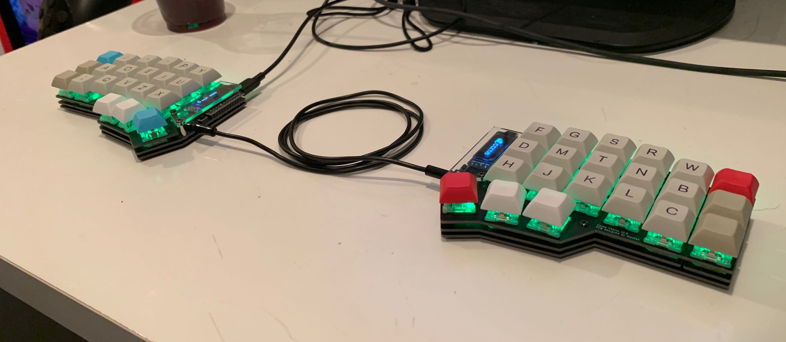
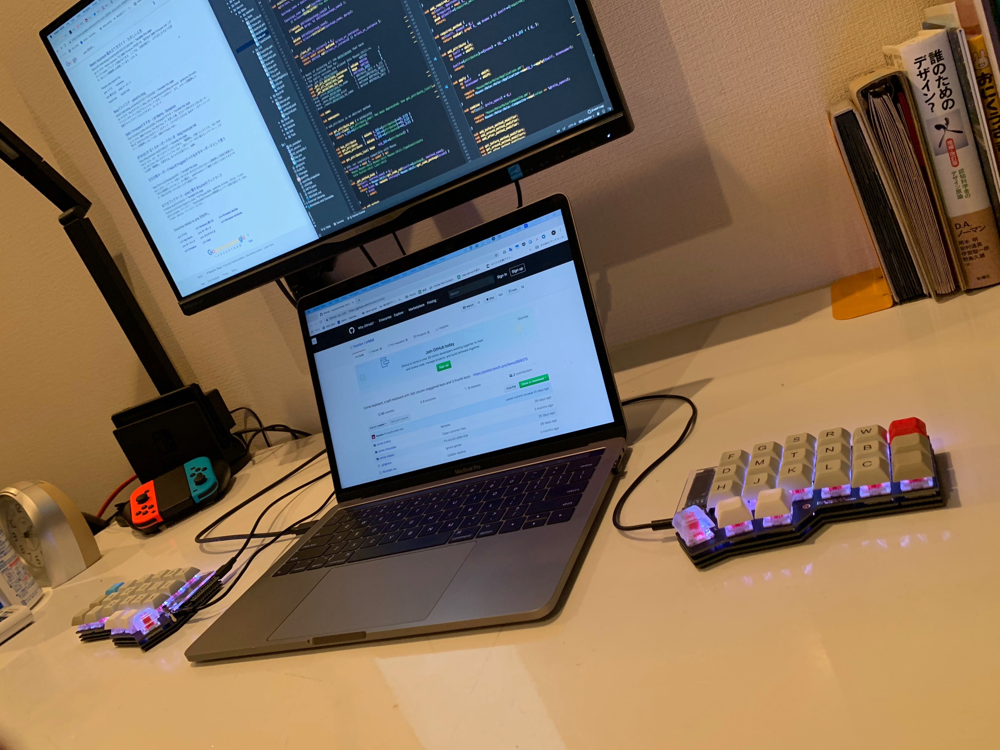
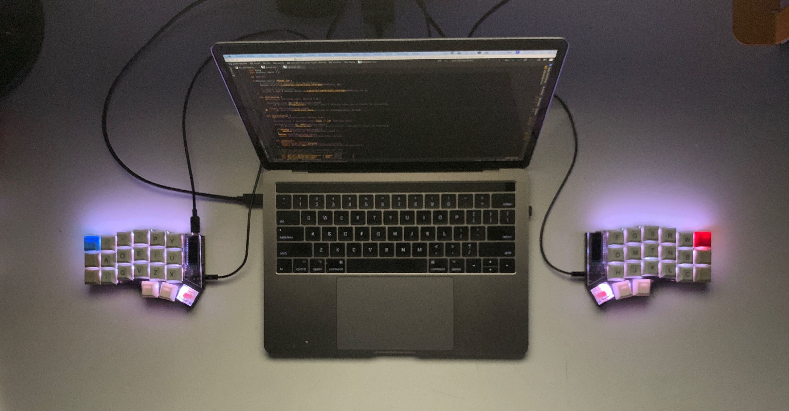
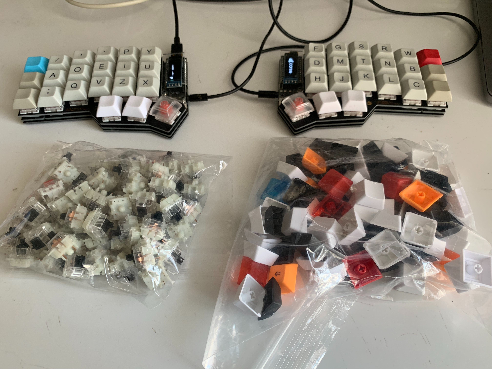

Corne Cherry Keyboardは、<a href="https://twitter.com/foostan" target="_blank">@foostan</a>さんが設計している自作キーボード。  
設計図はオープンソースになっており、GitHubにて公開されている。(<a href="https://github.com/foostan/crkbd/" target="_blank">foostan/crkbd</a>)  
また、現在は<a href="https://yushakobo.jp/news/2018/12/07/storeopen/" target="_blank">遊舎工房</a>さんの実店舗にてCorne Cherry Keyboardのキットが販売されている様子。

自分もキットを購入して実際にCorne Cherryを組み上げたので、実際に作ったり使ったりしてみての感想を書いていきます。

## 完成物

見た目と使い心地ともにとても満足しています。会社で毎日バリバリ使ってます。







## 出会い

常日頃から、左右分離式のキーボードほしいな〜と思っており、はじめはErgodox EZあたりを買おうかと思っていたが、Twitterかどこかに流れてきたCorne Cherry Keyboardの写真を見て一目惚れしたのがきっかけ。

## Corne Cherryのいいところ

### 3行 + 親指用キーしか無い

写真を見ての通り、数字列が無いという潔さ。Touch BarモデルのMacBookProのキーボードが64キーなのに対してCorne Cherryは42キーと、約2/3になっている。  
そのため、数字、記号、カーソルあたりの入力はレイヤ切り替え機能を使って同時押しで行うことになるが、もともとホームポジションから遠いカーソルキーはctrlとhjkl同時押しで代用したりしてたので、個人的にはそこまで問題とは感じなかった。むしろ、どのキーにもホームポジションから1キー以内で到達できるので、使い慣れれば最もストレスなく速く打てるレイアウトなのではないか、と思った。

### 見た目がかっこいい

フォルムがかっこよい。無駄がない。  
透明なカバーから覗くOLEDディスプレイもかっこよい。

### 薄い

作者の方いわく薄さにこだわっているとのこと。  
マイコンを外側に出すといった工夫により高さが抑えられており、タイプしやすい。

### ホットスワップ対応

PCBソケットという電子部品を使うことで、キースイッチ自体にはハンダ付けが不要となっており、ハンダ付け無しで簡単にキースイッチの取り外しや付け替えをすること(ホットスワップ)が可能。  
これは後で判明したことだが、自作キーボードをしばらく使ってるとほぼ100％他のキースイッチを試したくなってしまうので、ホットスワップが可能というのはかなり大きい。  
また、メンテの際に基板からキースイッチを剥がして裸にできるという点も地味に便利。

## そして購入

Corne Cherryの存在を知った直後、偶然にもその1週間後くらいに開かれる技術書典5にてキットが販売されると知って、購入を決意。
技術書典の当日は開場1時間前くらいに到着して並び、開場後は速攻で販売ブースに向かったが、それでも既に20〜30人くらいの行列になっていた。  
自分の番になる頃には、人気のカラーはすでに売り切れていた。自分はマットブラックのキットを購入させてもらった。

## 組み立て

キットには同梱されてないキーキャップやキースイッチを<a href="https://kbdfans.cn/" target="_blank">KBDfans</a>で調達し、ハンダごてなどの工具類はamazonで揃えた。  
中学校ぶりのハンダ付けだったが案外すぐ慣れて、時間はかかったが大きなトラブル無く作り終えることができた。
詳細なビルドログはいろいろな人が書いてくれてる気がするので自分は省略。

※ ただし、オプションのLEDのハンダ付けは結構大変だった

## キーマップ

キーボードのファームウェアはOSSの[qmk/qmk_firmware](https://github.com/qmk/qmk_firmware)を利用する。  
そのままでもいいけど、カスタマイズすることでキーマップを自由に変更できたり、OLEDディスプレイに表示する内容を好きに変えたりできるようになる。C言語で書かれているが、C言語が得意じゃなくても雰囲気で書き換えればなんとか動く。  
qmkではレイヤ機能のほか、長押し/短押しでの入力文字の変更なども可能となっている。ほかにも、全部把握できてないけどいろいろな機能がありそう。

今のところのキーマップは以下の形に落ち着いている。  
文字入力のためのレイヤは、デフォルト含め2つしか無い。今のところはそれで事足りている。  
キーマップについてもなるべくミニマムで抑えるようにしている。

```text
Default layer
+---+---+---+---+---+---+    +---+---+---+---+---+---+
|TAB| Q | W | E | R | T |    | Y | U | I | O | P | - |
+---+---+---+---+---+---+    +---+---+---+---+---+---+
|CTL| A | S | D | F | G |    | H | J | K | L | ; | ' |
+---+---+---+---+---+---+    +---+---+---+---+---+---+
|SFT| Z | X | C | V | B |    | N | M | , | . | / |SFT|
+---+---+---+---+---+---+    +---+---+---+---+---+---+
            |CMD|L2 |SPC|    |ENT|L2 |ALT|
            +---+---+---+    +---+---+---+

L2 layer
+---+---+---+---+---+---+    +---+---+---+---+---+---+
| ~ | @ | # | # | $ | % |    | & | * | ( | { | [ | _ |
+---+---+---+---+---+---+    +---+---+---+---+---+---+
| ` | 1 | 2 | 3 | 4 | 5 |    | + | = | ) | } | ] | | |
+---+---+---+---+---+---+    +---+---+---+---+---+---+
| ^ | 6 | 7 | 8 | 9 | 0 |    |   |   | < | > | ? | \ |
+---+---+---+---+---+---+    +---+---+---+---+---+---+
            |CMD|   |SPC|    |ENT|   |ALT|
            +---+---+---+    +---+---+---+
```

このほかに、ファンクションキー、音量キー、LEDのON/OFF切り替えなどの、文字入力以外のためのレイヤもあるがここでは省略。

#### 上記の図で表しきれてないキーマップ

キーが少ない分、同時押しや長押し/短押しによる出し分けなどをある程度駆使することになる。

|入力|入力方法|
|:---:|:--|
|\\|右のShiftキーを短く押す|
|英/かな切り替え|Command/Altを短く押す|
|Esc|Ctrl + ハイフン|
|バックスペース|Ctrl + m|

同時押しについては、HHKB使ってた時代の名残もあり今はソフトウェアで制御してて、Karabiner-Elementsを使って制御している。(まだきちんと調べられてないのだけど、ファームウェアでも同時押しのキーマップの設定は可能なのだろうか。)  

## 実際に使ってみて

### はじめての左右分離式

初めての左右分離式キーボードだったが、触り始めの頃はかなりおぼつかない感じで、タイピング速度が元の1割くらいしか出なかった。今まで1つだったものが2つに分かれるだけで体の感覚がこうもリセットされるのかという感じ。  
ただ、その違和感は一週間も触ってるといつの間にか消えるし、(アルファベットに関しては)タイピング速度も元の8割くらいにはすぐ戻る。自分の場合は使い始めて二週間位でもともと使ってたHHKBのタイピング速度と同じかそれ以上で打てるようになった。

そして、Corne Cherry Keyboardにしてから肩こりがなくなったような気がする。まぁもともとそこまで肩こりひどいタイプではなかったけど、夜まで仕事しててもデスクワーク起因っぽい体の疲れを殆ど感じなくなった。  
左右分離式だと肩幅で打るので肩を丸めなくて済み、良い姿勢でタイピングできると聞いてたが、たしかに効果ある気がする。

### キーの数

普通のキーボードに比べて数字や記号類がホームポジションから近くなったので、プログラミングがかなり快適になった。キーが全部近いので打ってて楽だし楽しい。  
改めて普通のキーボードを触ると、もはや数字や記号がとても遠く感じるようになっていた。

個人的には、この42キーというのは本当に無駄がなく、下限ギリギリのキー数であるように感じている。どのキーもまんべんなく使っていて、使用頻度低いキーが無い。これ以上減ると流石に厳しそう。  
実際には、ごくたま〜にキーが足りないと思うことはある。altやcommandが両手に欲しくなったりする。ただそこまで致命的ではない。
もしキー増やすとしても、親指用に左右それぞれ+1キーくらいかな、と思った。

### 慣れ

前述したように、タイピング速度はアルファベットだけなら2週間くらいで長年使ってたHHKBと同等かそれ以上になった。  
問題は記号類で、キー数少ない関係で基本的には一般的な配列を無視して完全に配列を考え直しになるので、なかなか覚えられず最初の方は苦労した。作業に支障出るほどではないけど、今でも結構間違う。記号や数字については、極力自分の中で合理的かつ規則的な配置にしておくと良さそう。  
そのほか、親指部分にENTERを割り当てたりしているが、それも最初は違和感が大きかった。  

単に慣れるために練習しようとしてもやっぱり続かないので、まぁ一応打てるかなというくらいになったらさっさと業務に実戦投入するのが一番てっとり早いと感じた。自分もその戦略だったけど、やはり仕事で使い始めると一瞬で慣れた。

### そのほか

たぶん自分のハンダ付けが下手くそなせいなんだけど、使っててキーが急に反応しなくなったり、逆にとあるキーを押すとその列のすべてのキーが反応してしまったりという事が不定期で起きる。はんだ付けがうまくできておらず、ショートさせてしまってる箇所があったりするっぽい。  
さっきまで使えてたのに急に調子悪くなることとかもあり、不具合が起きたときは家に持ち帰ってメンテしている。

今の自分の電子工作の腕前だと、さすがに既成品の安定性には勝てない部分はあると感じた。もっと習熟すれば市販品に遜色ないクオリティで仕上げることが可能になるのだろうか。

## そして沼へ

家にキーボードやキーボードのパーツが際限なく増えていく人たちの気持ちがちょっとわかるようになってきた。

自作キーボードは下手に自分でカスタマイズできてしまうせいで、より快適なキーボードを求めていろいろ試したくなってしまい、終わりが見えない。  
特にキースイッチやキーキャップの誘惑がすごくて、最初にCorne Cherryを作ろうと思った際には必要最低限な数のキースイッチやキーキャップだけを買ったはずなのに、なぜか今ではキーボードをもう1つ作れるくらいのそれが余っている。



キースイッチについては、最初は静音黒軸を使ってたけど、静音じゃないほうが打ち心地が軽やかで気持ちいい気がしてしまい、気づいたらBOX赤軸に変えていた。
そしてそれから一週間経った今、今度はBOX黒軸が欲しくなっている。多分この週末で買いに行くんだと思う。  
キーキャップについては、DSA ProfileのキーキャップじゃなくてCherry Profileのものを使ってみたくなって気づいたら購入していた。そのほか様々なカラーのキーキャップも少量ずつ購入してストックしています。

そのほか、いま興味があるのは以下。

- MDAかXDA profileのキーキャップ欲しい、かわいい
- 2台目作りたい
    - 次はもっとうまくはんだ付けできるはずという自信
    - いつのまにかキースイッチとかが余り出していたので、2台目作れてしまいそうでハードルが下がっている
- BLE Micro Proでワイヤレス自作キーボードを作って、コードの煩わしさから開放されたい

## まとめ

自作キーボードは、作っても楽しいし、使っても楽しい。  
苦労しながらハンダ付けをして、動作確認時にきちんとキー入力を受け付けてくれたときや、LEDがきちんと光ったときの嬉しさとか、いつまでも眺めてしまう感じとかは久々の感覚だった。  
これからも楽しんでいきたい。

## 最後に

End-gameへの道は遠い

この記事はCorne Cherry Keyboardで書きました。
