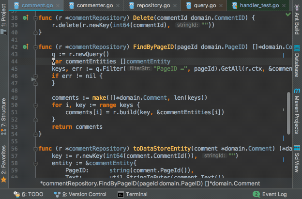
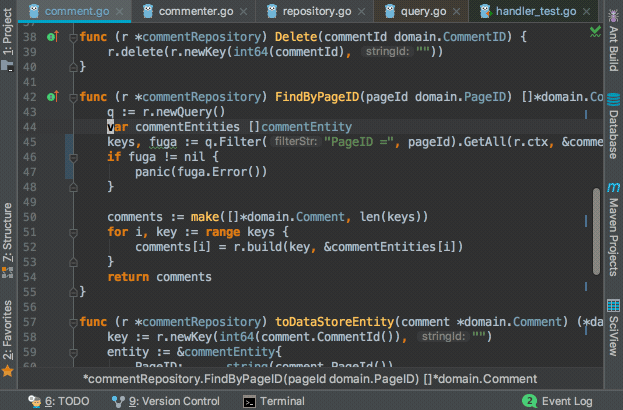

## IdeaVim

<preview-link title="IdeaVim" url="https://plugins.jetbrains.com/plugin/164-ideavim"></preview-link>
Github: [JetBrains/ideavim](https://github.com/JetBrains/ideavim)

IdeaVim is a Vim emulation plugin for IntelliJ or other Jetbrains IDEs. This plugin are officially developed by Jetbrains as you can see the repository owner name.

### Demo

Keymap has been personally customized.

<center>
    </img>
</center>

### Why use IdeaVim

The followings are advantages in each of IntelliJ and Vim, I think.

- **IntelliJ**: Very powerful code completeion, code navigation, refactoring, and so on with easy and simple settings.
- **Vim**: Very various and efficient operations as Text Editor. An concept of mode(normal/insert/visual) and keymap.

So, **IntelliJ with Vim-like operation can take both of those advantages**. IdeaVim supports the majority of Vim features, even though it hasn't yet been able to support the details.

In this blog post, I'll introduce what features IdeaVim supports, how to setup IdeaVim, and how great IdeaVim is.

## Supported Vim features

The followings are frequently used Vim features supported by IdeaVim.

|Feature|Supported|
|-------|---|
|Mode|NORMAL, INSERT and VISUAL mode|
|Motions|yank(`y`), delete(`d`), change(`c`), undo(`u`), redo(`Ctrl-r`), <br>text object operation(`ciw`,`ci'`, ... ) and so on|
|Search| textsearch and highlight by `/`, incremental search by `:set incsearch`|
|Replace| `:s`,`:%s`,`:'<,'>s` and so on|
|Commands|`:w`, `:q`, `:tabnew`, `:split`, a part of `:set` command and so on |
|Keymap|We can customize keymaps by same syntax with `.vimrc`. We can use `map`, `set` and other some commands. The details of this feature will be introduced later of this blog post.|
|Macro|available|
|Register|available|
|Others|`:set surround` enables [vim-surround](https://github.com/tpope/vim-surround) emulation|

You can see more details at README.md of [GitHub repositoy](https://github.com/JetBrains/ideavim).


## Install IdeaVim

In IntelliJ or other Jetbrains IDEs, you can install IdeaVim from `[Preferences] > [Plugins]`.
After install, you have to restart IDE to enable IdeaVim.


### EAP build

You can install EAP (Early Access Program) build of IdeaVim by adding the following URL to `[Settings] > [Plugins] > [Browse Repositories] > [Manage Repositories]`.

[https://plugins.jetbrains.com/plugins/eap/ideavim](https://plugins.jetbrains.com/plugins/eap/ideavim)

Currently, a new version of IdeaVim is officially released about a few times for a year, so sometimes bug fixes or new features are not released soon.
So I normally use EAP build.

## How to setup IdeaVim

### .ideavimrc

IdeaVim loads `~/.ideavimrc` when IDE started. We can write settings to `.ideavimrc`, with same syntax as `.vimrc`. A list of supported `set` commands is [here](https://github.com/JetBrains/ideavim/blob/master/doc/set-commands.md).  
In addition, `set surround` enables a [vim-surround](https://github.com/tpope/vim-surround) emulation.

```vim
set incsearch
set ignorecase
set smartcase

nnoremap L $
nnoremap H ^
noremap ; :
```

### DRY in Vim and IdeaVim keymaps

`.vimrc` and `.ideavimrc` can be written as same syntax. This is a large advantage, because you don't need to learn new specific syntax, and you can share the settings of the common basic keymaps (e.g. `nnoremap ; :`) between both of them.  

To share the settings, I prepared a shared keymaps file `.vimrc.keymap`. It is loaded in `.vimrc` and `.ideavimrc` by a `source` command.  
Thus you can centralize the common basic keymaps to one file. You can keep DRY principle.

##### .ideavimrc

```vim
" Load common basic keymaps
source .vimrc.keymap

" IdeaVim specific settings are here
```

##### .vimrc.keymap
```vim
" Common basic keymaps
nnoremap L $
nnoremap H ^
noremap ; :
```

The followngs are my `.ideavimrc` and `.vimrc.keymap`.

- [.ideavimrc](https://github.com/ikenox/dotfiles/blob/master/ideavimrc)
- [.vimrc.keymap](https://github.com/ikenox/dotfiles/blob/master/vimrc.keymap)

### Vim-like keymap to IntelliJ features

In my `.ideavimrc`, a statement `map XXX :action YYY` often appears.  
`:action` is a IdeaVim-specific command. By using `:action` command, you can call IntelliJ features.  
The following is an example.

```vim
nnoremap gd :action GotoDeclaration
```

`GotoDeclaration` is called "action". It corresponds a one of the IntelliJ features. It navigates to the declaration of a symbol on a your text cursor.  
So, `nnoremap gd :action GotoDeclaration` means, "When you type `gd`, then you'll be navigate to the declaration of a symbol on the cursor".

Thus, by using `:action` command, **you can define a vim-like keymap to any IntelliJ features, even very powerful code modification, code navigation, refactoring, and more features.** 

You can call any IntelliJ features, from high-level features (e.g. refactoring) to low-level features (e.g. move text cursor). You can also call features of IntelliJ Plugin you've installed.

The `:action` command dramatically boosts the convinience of IdeaVim-ed IntelliJ.  
The followings are my recommended actions.

#### Examples of Action

|Action|概要|
|----|----|
|SearchEverywhere|Navigate to any symbol|
|FindInPath|Find text in the whole project|
|FileStructurePopup|Navigate to any symbol in current file|
|GotoDeclaration|Navigate to the declaration of a symbol|
|GotoSuperMethod|Navigate to the super method of a symbol|
|GotoImplementation|Navigate to the implementation of an interface|
|JumpToLastChange|Navigate to the place changed at last|
|FindUsages|List the usages of a symbol|
|RenameElement|Rename symbol|
|ReformatCode|Format code|
|CommentByLineComment|Comment out|
|ShowIntentionActions|Quick fix|
|GotoAction|Call anything|

#### 設定例

```vim
nnoremap ,e :action SearchEverywhere<CR>
nnoremap ,g :action FindInPath<CR>
nnoremap ,s :action FileStructurePopup<CR>

nnoremap gd :action GotoDeclaration<CR>
nnoremap gs :action GotoSuperMethod<CR>
nnoremap gi :action GotoImplementation<CR>
nnoremap gb :action JumpToLastChange<CR>

nnoremap U :action FindUsages<CR>
nnoremap R :action RenameElement<CR>

nnoremap == :action ReformatCode<CR>
vnoremap == :action ReformatCode<CR>

nnoremap cc :action CommentByLineComment<CR>
vnoremap cc :action CommentByLineComment<CR>

nnoremap <C-CR> :action ShowIntentionActions<CR>

nnoremap ,a :action GotoAction<CR>
vnoremap ,a :action GotoAction<CR>
```

### Search an action name

If you want to know the action name of some IntelliJ features, you can use a .
You can search an action by words, by using `:actionlist` command.

<center>
    </img>
</center>

But, currently, there is no way to know the action name of IntelliJ functions which you want to call from IdeaVim.  
When called `:actionlist`, the shortcut key binding of the each action is displayed. It may be a hint of corresponded IntelliJ features.

## Conclusion

In this blog post I introduced IdeaVim. IdeaVim hasn't emulated Vim completely yet, but still great plugin.  
Let's enjoy IdeaVim!
